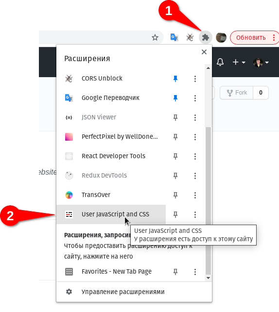
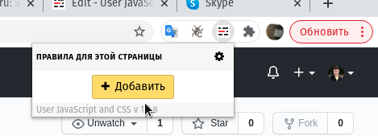

# Кастомные скрипты 
Для подключения кастомных скриптов нужно установить [расширение](https://chrome.google.com/webstore/detail/user-javascript-and-css/nbhcbdghjpllgmfilhnhkllmkecfmpld)

Добавление скрипта

